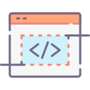
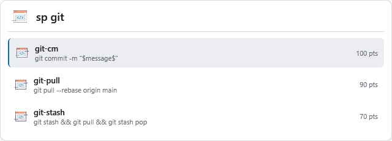
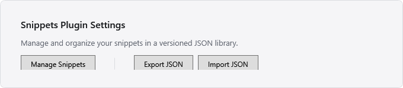
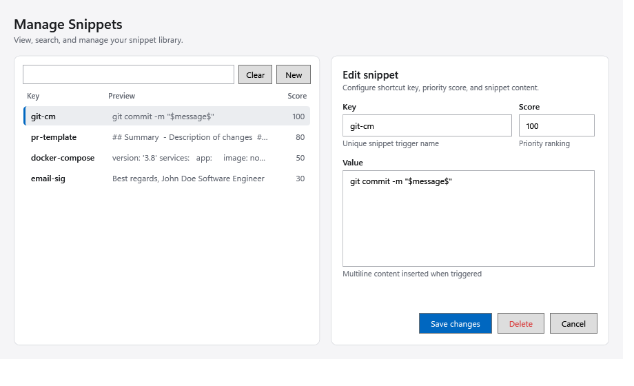

#  Flow Launcher Snippets Plugin

A fast snippet manager plugin for [Flow Launcher](https://www.flowlauncher.com/) to store, search, and copy reusable code snippets and text templates directly to your clipboard.

## Features

- **Instant Search**: Type `sp <keyword>` to filter snippets in real time.
- **Direct Clipboard Copy**: Press `Enter` to copy snippet content directly to clipboard.
- **WPF Management UI**: Add, edit, and delete snippets with real-time validation.
- **Export & Import**: Backup your snippets to a portable JSON file or restore them with Replace All.
- **Lightweight Storage**: Human-readable, versioned `snippets.json` file.

## Quick Start

1. Open Flow Launcher (`Alt + Space` by default).
2. Type `sp` followed by a snippet key or keyword.
3. Press `Enter` to copy snippet content to your clipboard.



> [!TIP]
> Snippets with higher `score` values appear higher in search results.

## Managing Snippets

Open Flow Launcher settings (`Plugins` -> `Snippets`) or launch the Snippet Manager:



### Snippet Manager Window

The Snippet Manager lets you create, edit, search, and delete snippets without manual file editing:



- **Search & Filter**: Find snippets quickly using the search bar on the left.
- **Add / Edit**: Fill in Key, Score, and Value on the right, then click **Save changes**.
- **Delete**: Select a snippet and click **Delete** (includes confirmation prompt).
- **Export / Import**: Accessible from the plugin settings panel.

## Storage Format (`snippets.json`)

All snippets are stored in a human-readable JSON format.

### File Location

`%APPDATA%\FlowLauncher\Settings\Plugins\Flow.Launcher.Plugin.Snippets\snippets.json`

> [!NOTE]
> When modifying snippets via the UI, an automatic backup is kept at `snippets.json.bak`.

### JSON Schema

| Field | Type | Description |
| --- | --- | --- |
| `version` | Integer | Schema version number (currently `1`). |
| `snippets` | Array | List of snippet objects. |
| `snippets[].key` | String | Unique identifier used for searching in Flow Launcher. Case-insensitive. |
| `snippets[].value` | String | Full text inserted to the clipboard. Supports multiline content and special characters. |
| `snippets[].score` | Integer | Priority ranking score for search ordering (e.g. 0–100). Higher score ranks higher. |

### Example `snippets.json`

```json
{
  "version": 1,
  "snippets": [
    {
      "key": "git-cm",
      "value": "git commit -m \"$message$\"",
      "score": 100
    },
    {
      "key": "pr-template",
      "value": "## Summary\n\n- Description of changes\n\n## Verification\n- [x] Tested locally",
      "score": 80
    },
    {
      "key": "docker-compose",
      "value": "version: '3.8'\nservices:\n  app:\n    image: node:20\n    ports:\n      - '3000:3000'",
      "score": 50
    },
    {
      "key": "email-sig",
      "value": "Best regards,\nJohn Doe\nSoftware Engineer",
      "score": 30
    }
  ]
}
```

## Screenshot Automation

Screenshots in this documentation are generated programmatically:

```powershell
pwsh -STA -NoProfile -File ./scripts/capture-screenshots.ps1
```

The script renders the WPF controls in memory and outputs high-resolution images to `docs/images/`.
